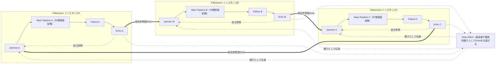

## 第6章：進行モデル

### 第1節：Main Pipeline進行構造

| 進行順序   | 段階名               | 機能                                                | 前提条件                                                      |
| ------ | ----------------- | ------------------------------------------------- | --------------------------------------------------------- |
| 第0段階   | Immunity Collapse | システムの自己修復機能が無効化される                                | システムに自己修復機能が内蔵されていること。先天型の場合、設計段階で未実装であることにより確定済み         |
| 第0段階下位 | Phantom Immunity  | 無効化された免疫の外殻が残存し、Camouflageの素材となる                  | Immunity Collapseが完了していること                                |
| 第0.5段階 | Incubation Period | 免疫は既に無いが設計の慣性でシステムが表面上健全に動き続ける                    | Immunity CollapseおよびPhantom Immunityが成立していること             |
| 第1段階   | Jammer            | 運用者が設計意図に逆行する起点行為を実行する                            | 免疫機能が無効化されていること。先天型の場合、設計段階で条文・制度として印刷済み                  |
| 第2段階   | Pandemic          | 逸脱がシステム全体に伝染的に拡大する                                | Jammerが実行されていること                                          |
| 第2.5段階 | Erosion           | 設計意図が漸次的に風化する                                     | Pandemicが進行中であること                                         |
| 第3段階   | Divergence        | システムが多方向に分裂・変異する                                  | PandemicとErosionが十分に進行していること                              |
| 第4段階   | Segment           | 分裂した断片が孤立し相互接続を失う                                 | DivergenceおよびSiphon Line S-3の合流                           |
| 第5段階   | Inversion         | 設計意図と正反対の結果が確定する                                  | Segmentにより原設計の参照が不可能になること。Normalization Line N-4による加速を受ける |
| 第6段階   | Convergence       | 全分裂体が同一の崩壊構造に収束する                                 | Inversionが確定していること                                        |
| 残留段階   | Fallout           | システム消滅後も汚染が継続する。内部にEchoとDesign Ghostを含む           | Convergenceにより崩壊が完了していること                                 |
| 再起動段階  | Echo              | FalloutがJammerとして機能しサイクルが再起動する。自己参照型と相互参照型の二形態を持つ | Falloutが未解消のまま残留していること                                    |

※先天型（Congenital）の場合、Phantom Immunityは設計文書・憲章・条文そのものとして発現する。詳細は第3章第1節『先天型における段階の省略』を参照。

### 第2節：Siphon Line進行構造

|進行順序|段階名|機能|トリガー元|
|---|---|---|---|
|S-1|Appropriation|風化したシステムから都合の良い部分を恣意的に切り取る|Main Pipeline: Erosion|
|S-2|Scavenging|分裂した断片から残存価値をさらに収奪する|Main Pipeline: Divergence|
|S-3|Exhaustion|断片の残存価値が完全に消失する|Scavenging完了|
|合流|→ Segment|ExhaustionがMain PipelineのSegmentを確定させる|S-3完了|

### 第3節：Normalization Line進行構造

|進行順序|段階名|機能|トリガー元|
|---|---|---|---|
|N-1|Tolerance|逸脱への違和感が薄れ始める|Main Pipeline: Erosionの継続|
|N-2|Acceptance|逸脱が「仕方ない」として処理される|N-1の定着|
|N-3|Integration|逸脱が制度・言語・文化に組み込まれる|N-2の定着|
|N-4|Inversion of Standard|元の設計意図が「非現実的」として否定される|N-3の定着|
|加速|→ Inversion|N-4がMain PipelineのInversionの確定を不可逆にする|N-4完了|

### 第4節：並行作動要素・時間軸派生要素

|分類|要素名|作動条件|作動範囲|
|---|---|---|---|
|並行作動|Camouflage|Fallversionが進行中であること|Main PipelineのImmunity CollapseからFalloutまで、Siphon Lineの全過程、Normalization LineのN-1からN-3まで。N-4到達後は不要となる|
|並行作動|Acceleration Feedback|Siphon Lineが起動していること|Siphon Line起動（Erosion以降）からFalloutまで、Siphon LineとMain Pipelineの間で常時作動|
|時間軸派生|Mutation|Divergenceが発生していること|Divergenceから時間軸方向へ派生|

### 第5節：Fallout内部構造

|残留物|作用方向|次サイクルへの影響|
|---|---|---|
|Echo|崩壊パターンの伝播|自己参照型：自己のJammerとして再起動。相互参照型：他のインスタンスのJammerとして送信、または他のインスタンスから受信|
|Design Ghost|設計意図の幻影の伝播|「かつての理想」への郷愁がシステム再建の動機となり、先天型Fallversionを再生産する|

### 第6節：進行フロー図

```mermaid
flowchart TD
    subgraph FV["Fallversion"]

        subgraph MAIN["Main Pipeline（主語：システム）"]
            IC["0 - Immunity Collapse - 防壁消失"]
            PI["0下位構造 - Phantom Immunity - 免疫の残骸"]
            IP["0.5 - Incubation Period - 潜伏"]
            JM["1 - Jammer - 点火"]
            PD["2 - Pandemic - 感染拡大"]
            ER["2.5 - Erosion - 緩慢浸食"]
            DV["3 - Divergence - 分裂"]
            SG["4 - Segment - 孤立化"]
            IV["5 - Inversion - 反転"]
            CV["6 - Convergence - 崩壊収束"]

            IC --> PI
            PI --> IP
            IP --> JM
            JM --> PD
            PD --> ER
            ER --> DV
            DV --> SG
            SG --> IV
            IV --> CV
        end

        subgraph SIPHON["Siphon Line（主語：運用者）"]
            AP["S-1 Appropriation - 私物化"]
            SC["S-2 Scavenging - 残骸漁り"]
            EX["S-3 Exhaustion - 枯渇"]

            AP --> SC
            SC --> EX
        end

        subgraph NORMAL["Normalization Line（主語：システム参加者全体）"]
            TL["N-1 Tolerance - 許容"]
            AC["N-2 Acceptance - 受容"]
            IG["N-3 Integration - 統合"]
            IS["N-4 Inversion of Standard - 基準反転"]

            TL --> AC
            AC --> IG
            IG --> IS
        end

        subgraph FALLOUT["Fallout（残留段階）"]
            FO["Fallout - 長期汚染"]
            EC["Echo - 崩壊パターンの伝播"]
            DG["Design Ghost - 設計意図の幻影の伝播"]

            FO --> EC
            FO --> DG
        end

        subgraph AUX["並行作動要素"]
            CAM["Camouflage - 全過程隠蔽"]
            AF["Acceleration Feedback - 加速帰還ループ"]
        end

        subgraph TIME["時間軸派生要素"]
            MT["Mutation - 時間的変異"]
        end

        CV --> FO

        EC -.->|"自己参照型Echo 次サイクルのJammerへ"| JM
        DG -.->|"先天型FVを再生産"| IC

        ER -.->|"trigger"| AP
        DV -.->|"trigger"| SC
        EX -.->|"merge"| SG

        ER -.->|"trigger（継続）"| TL
        IS -.->|"加速"| IV

        AP -.->|"相互強化"| TL
        EX -.->|"相互強化"| IG

        AF -.->|"収奪が崩壊を加速"| ER
        AF -.->|"崩壊が収奪機会を拡大"| AP

        CAM -.->|"隠蔽"| IC
        CAM -.->|"隠蔽"| CV
        CAM -.->|"隠蔽"| AP
        CAM -.->|"隠蔽"| EX
        CAM -.->|"N-3まで作動・N-4到達後は不要"| IS

        DV -.->|"時間軸派生"| MT
        MT -.->|"形態変異で再出現"| DV

    end
```

### 第7節：複合接続フロー図

複数のFallversionインスタンスが相互参照型Echoによって接続される構造を示す。

---
