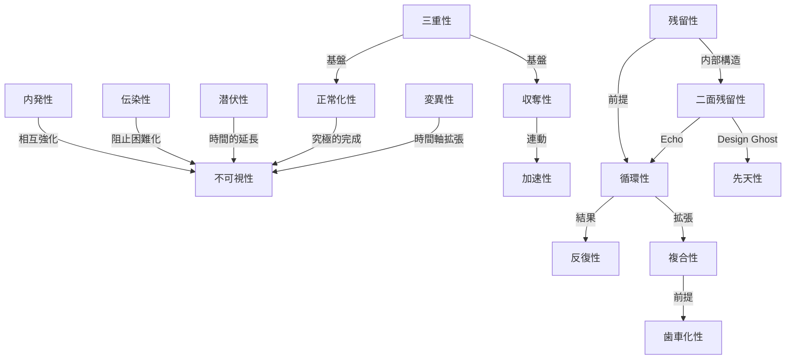

## 第7章：構造的特性

Fallversionは以下の固有の性質を持つ。これらの性質は個別に作用するのではなく、相互に強化し合いながらシステムの崩壊を駆動する。Ver.2.0では内部構造の拡張に伴い、新たな特性を追加した。

|特性名|定義|他特性との関係|出自|
|---|---|---|---|
|**内発性**|崩壊の起点はシステム外部の敵ではなく、内部の運用者自身にある|不可視性と相互強化する。内部起点であるがゆえに検知されにくい|Ver.1.1|
|**伝染性**|一箇所の逸脱がシステム全体に波及する|Pandemic段階の駆動力である。不可視性により伝染の阻止が困難になる|Ver.1.1|
|**潜伏性**|Immunity Collapse完了後、Jammerが発火するまでの間にシステムが表面上健全に機能し続ける。Phantom Immunityがこの潜伏を維持する|不可視性を時間的に延長する。潜伏期間が長いほど、崩壊開始の認識が遅れる|Ver.2.0新設|
|**三重性**|崩壊過程（Main Pipeline）、収奪過程（Siphon Line）、認識の正常化過程（Normalization Line）が同時並行で進行する|収奪性および正常化性の構造的基盤である。三重構造であるがゆえに単一視点では全容を把握できない|Ver.2.0改訂（Ver.1.1の「二重性」を拡張）|
|**収奪性**|崩壊の過程で運用者が価値を吸い上げ、崩壊をさらに加速させる|三重性により成立する。Siphon Lineの駆動力であり、Segmentの確定要因となる。Acceleration Feedbackを介してMain Pipelineの進行速度に直接影響する|Ver.1.1（Acceleration Feedbackとの連携をVer.2.0で追記）|
|**正常化性**|逸脱が「新しい正常」として認識に定着し、最終的に元の設計意図が「非現実的」として否定される|三重性により成立する。Normalization Lineの駆動力である。不可視性を究極的に完成させる。Camouflageが「隠蔽」であるのに対し、正常化性は「隠蔽の必要すら消滅させる」|Ver.2.0新設|
|**残留性**|元のシステムが消滅した後も崩壊の影響が継続する|循環性の前提条件である。残留するからこそ次のサイクルが起動する|Ver.1.1|
|**二面残留性**|Fallout内部にEcho（崩壊パターンの残留）とDesign Ghost（設計意図の幻影の残留）という相反する二つの残留物が共存する|残留性の内部構造を記述する。Echoが崩壊を再起動し、Design Ghostが先天型Fallversionを再生産する。両者は相反する方向から次のサイクルを駆動する|Ver.2.0新設|
|**不可視性**|運用者自身が崩壊に加担している自覚を持たない|Camouflageの作動により維持される。内発性と伝染性を検知不能にする。Normalization Lineの完了により究極的に完成する|Ver.1.1（Normalization Lineとの連携をVer.2.0で追記）|
|**反復性**|未解消のFalloutが存在する限り、異なる時代・場所で同一のパターンが再発する|残留性と循環性の結果として発現する|Ver.1.1|
|**循環性**|EchoによりFalloutが次のJammerとなり、崩壊サイクルが永続する|残留性が前提である。反復性の構造的原因となる。Ver.2.0では自己参照型と相互参照型の二形態を持つ|Ver.1.1（Echo拡張をVer.2.0で追記）|
|**変異性**|Mutationにより駆動される性質。崩壊の同一性が外見の変化によって隠蔽される|不可視性を時間軸方向にも拡張する|Ver.1.1|
|**複合性**|複数のFallversionインスタンスが相互参照型Echoにより接続され、個別サイクルを超えた複合崩壊構造を形成する|循環性の拡張である。単体では解消可能な崩壊が、複合化により解消困難度が指数的に上昇する。Gear Effectの発現条件となる|Ver.2.0新設|
|**歯車化性**|Gear Effectにより駆動される性質。被害者がサイクルの構造的媒介として機能する|複合性が前提である。被害者の被害が制度的サイクルの燃料として消費される構造を記述する|Ver.2.0新設|
|**加速性**|Acceleration Feedbackにより駆動される性質。収奪と崩壊が正のフィードバックループを形成し、相互に加速する|収奪性と連動する。Siphon Lineの濃度が高いほど加速が顕著になる|Ver.2.0新設|
|**先天性**|Immunity CollapseおよびJammerが設計段階から構造に組み込まれている性質|Design Ghostにより再生産される。先天型Fallversionの駆動力であり、通常型とは異なる進行パターンを生む|Ver.2.0新設|

### 特性間の構造的関係

以下に、特性間の主要な関係を示す。

---
